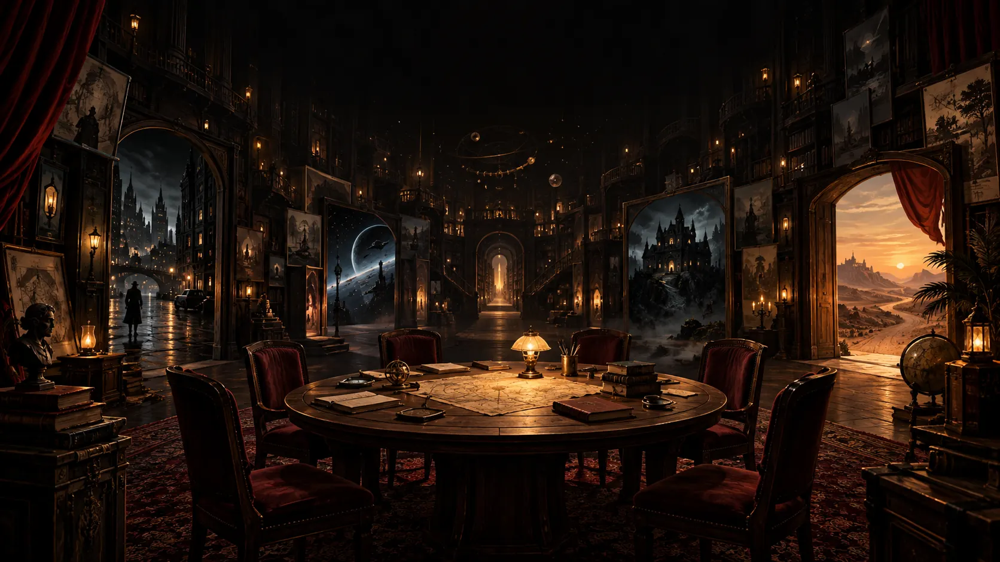

# MR · Story Night — Follow para Foundry VTT



<p align="center">
  <strong>Una misión. Una compañía. Tres retos. Una historia que recordar.</strong><br>
  Sistema sin director para jugar a <em>Follow</em> en Foundry VTT.
</p>

<p align="center">
  <a href="https://github.com/ManuRomera/mr-story-night/releases/latest"></a>
  
  
  <a href="LICENSE"></a>
</p>

> **Implementación no oficial y para uso privado** del juego **[Follow](https://www.lamemage.com/follow/)**, de **Ben Robbins** (Lame Mage Productions). No está afiliada ni aprobada por su autor. Para jugar necesitas conocer las reglas: la edición gratuita *Follow: A New Fellowship* está en [lamemage.com/follow](https://www.lamemage.com/follow/) y en [itch.io](https://lamemage.itch.io/follow-new-fellowship). Si Follow te gusta, cómpralo.
>
> Este repositorio no incluye textos del libro: todas las pantallas, ayudas y misiones de ejemplo están redactadas desde cero. Las misiones oficiales puedes introducirlas tú en tu mundo desde la pestaña **Misiones**.

**Versión 0.8.0** · Foundry VTT v13 · Español e inglés · Sin director de juego

## Cómo está organizado

Como en otros sistemas de mesa compartida (el club de *Brindlewood Bay*, por ejemplo), hay **una hoja común y una ficha por jugador**:

- **La compañía** (Actor compartido): la misión, el paso en que está la partida, los retos, las escenas, el cuenco de piedras, la crónica y la comodidad en mesa. Todo el grupo la ve y la usa.
- **Tu personaje** (Actor tuyo): nombre, concepto, pronombres, qué significa para ti el éxito, lo que necesitas del protagonista de tu izquierda, un detalle y notas. Lo editas directamente, como cualquier ficha de Foundry. Cada asiento tiene un protagonista y un secundario.
- **El vestíbulo**: para empezar partidas, gestionar misiones y ver las compañías anteriores.

**Todos escriben a la vez.** Lo que cada persona escribe en la hoja común o en una ficha aparece en vivo en las pantallas del resto, y cada cual puede estar en un campo distinto al mismo tiempo. Cuando alguien entra en un campo, a los demás les aparece bloqueado con su nombre («Escribiendo: Lucía»); si otra persona intenta escribir ahí, se le avisa de quién lo está editando.

**Lectura cómoda.** El botón de accesibilidad de la cabecera de cualquier ventana (junto a la X) abre un panel con modo lectura (fondo negro y letra clara que no deslumbra), color y tamaño de la letra, tipografía sencilla, espaciado amplio y menos animaciones. Se aplica al momento a todas las ventanas del sistema y a las tarjetas del chat, y se guarda en cada dispositivo.

Una franja en ambas fichas dice **a quién le toca y qué**: «Te toca plantear la escena 2», «Faltan piedras de: Irene»… Como no hay director, cada persona sabe en todo momento qué hacer. Los momentos clave (reto elegido, cada escena, resultado de las piedras, pérdidas) se publican también como **tarjetas en el chat**.

## Cómo se juega en Foundry

¿Primera vez? Abrid la pestaña **Cómo se juega** del vestíbulo o de la hoja común: resume cada fase, qué hacéis en ella y para qué sirve. Además, al principio de cada fase aparece una tarjeta breve con **Ahora** y **Para qué** (se puede ocultar).

1. **Vestíbulo** (botón en el directorio de Actores): elegís la misión, filtrando por género o al azar, y quién se sienta a la mesa, en orden. Al empezar se crea una carpeta con la hoja de la compañía y dos fichas por asiento, cada una propiedad de su jugador.
2. **La misión**: leéis la introducción, la personalizáis respondiendo a las preguntas y elegís dos dificultades.
3. **La compañía**: cada jugador crea su personaje principal (nombre, concepto, *Lo que quiero de la misión* y *Lo que quiero de ti* hacia el de su izquierda) y su secundario (nombre y concepto), y marca «Estoy listo».
4. **Tres retos**, cada uno con los mismos pasos:
   - quien no haya elegido antes escoge el reto y explica por qué es difícil; decide qué personaje principal lo abre (no puede ser el suyo) y el grupo fija el ritmo;
   - una escena por persona, empezando por ese jugador y hacia la izquierda: quién está, dónde y qué pasa. Cualquiera puede añadir consecuencias;
   - cada cual elige sus piedras en secreto; cuando están todas se muestran a la vez, se explican las rojas y se sacan dos;
   - si hay pérdida, el grupo decide quién sale de la historia; el secundario asciende, y quien se queda sin personajes adopta uno o presenta a alguien nuevo.
5. **Epílogo** en cada ficha y **créditos** imprimibles. La compañía queda en el directorio como archivo.

## Contenido incluido

**24 misiones originales** (en castellano y en inglés), cada una con introducción, objetivo, cinco preguntas, seis dificultades, ocho conceptos, seis deseos y ocho retos. Las doce más recientes incluyen además seis ejemplos de «Lo que quiero de ti»:

| Misión | Género |
|---|---|
| El paso del invierno | Fantasía |
| Estación Meridiana | Ciencia ficción |
| La casa de la calle Almendro | Terror |
| Campamento Lago Negro, 1986 | Terror (slasher) |
| El pozo de Villaruz, 1923 | Horror cósmico |
| La expedición del Esperanza, 1931 | Horror cósmico |
| La herencia de los Valcárcel | Horror gótico |
| La romería de San Ciriaco | Folk horror |
| Lluvia sobre Barcelona, 1947 | Noir |
| La diligencia de Santa Muerte | Western |
| El golpe del Liceo | Golpe |
| Semillas | Postapocalipsis |
| La corona de sal | Fantasía |
| La biblioteca ahogada | Fantasía |
| Última señal desde Titán | Ciencia ficción |
| El voto de Aurora | Ciencia ficción |
| Neón en Lavapiés, 2089 | Cyberpunk |
| El agua de San Lázaro | Western |
| El caso Arnau, Valencia 1956 | Noir |
| Guardia de noche en La Merced | Terror |
| Los niños de Valdeniebla | Folk horror |
| La radio de Peñas Negras | Postapocalipsis |
| Subasta en Montecarlo, 1962 | Golpe |
| El internado de Santa Clara, 1899 | Horror gótico |

**Editor de misiones** (vestíbulo → Misiones): cada campo explica qué tipo de contenido lleva y qué aporta a la partida, y las listas muestran cuántas entradas tienen, el mínimo que exige el juego y lo recomendado. Si tienes el libro de *Follow*, puedes pasar sus misiones a tu mundo con él; se guardan en el mundo, no en el sistema, y se pueden exportar e importar.

**Generadores**: unas 1.300 entradas por idioma en 10 géneros, con nombres y apellidos, conceptos, deseos, deseos hacia la izquierda con el nombre del vecino, detalles, lugares, situaciones, retos, dificultades, consecuencias y arranques de epílogo. Cada misión combina sus propias listas con las de su género, y un personaje generado tiene más de cien mil combinaciones posibles.

Cada género tiene además su propia estética: fantasía, ciencia ficción, terror, horror cósmico, gótico, folk, noir, western, postapocalipsis o cyberpunk.

## Tabla de resultados

La tabla vive en `scripts/engine.js` (`OUTCOMES`) y se puede ajustar si tu edición difiere:

| 1ª piedra (la compañía) | 2ª piedra (el reto) | Resultado |
|---|---|---|
| Blanca | Blanca | Éxito |
| Roja | Blanca | Éxito, pero se pierde un personaje |
| Blanca | Roja | Fracaso y se pierde un personaje |
| Roja | Roja | Fracaso y traición (o pérdida) |

## Instalación

En Foundry VTT: **Sistemas de juego → Instalar sistema** y pega esta URL de manifiesto:

```text
https://github.com/ManuRomera/mr-story-night/releases/latest/download/system.json
```

También puedes descargar `mr-story-night.zip` desde la [última versión publicada](https://github.com/ManuRomera/mr-story-night/releases/latest) e instalarlo manualmente.

**Importante:** Foundry necesita un usuario GM conectado para guardar la hoja común y crear fichas. Aquí ese GM actúa solo como **anfitrión técnico**: es un asiento más de la mesa, no dirige la partida. Si no hay anfitrión conectado, la mesa lo avisa. Cada jugador edita su propia ficha sin depender de nadie.

La compañía activa se abre sola al entrar (se puede desactivar). También se abre desde los botones del directorio de Actores, desde la barra de **Ajustes**, desde el icono de la capa de **Notas** o con `Mayús + T`.

## Desarrollo

Requiere Node 20 o posterior.

```text
npm test          # motor de reglas y vistas: partida completa simulada, permisos, piedras, traducciones
npm run validate  # JSON, sintaxis, plantillas, paridad de idiomas y referencias del manifiesto
npm run release   # valida, prueba y empaqueta en outputs/
```

La arquitectura está en [docs/ARCHITECTURE.md](docs/ARCHITECTURE.md) y la lista de pruebas manuales en [docs/TESTING.md](docs/TESTING.md).

## Créditos

- Juego original: **Follow**, © Ben Robbins / Lame Mage Productions. Todos los derechos de sus textos pertenecen a su autor.
- Sistema para Foundry: Manu Romera. El código se publica con licencia MIT (ver [LICENSE](LICENSE)); la licencia no cubre el juego Follow.
- Tipografías incluidas: Cormorant Garamond e Inter, bajo SIL Open Font License (`assets/fonts`).
